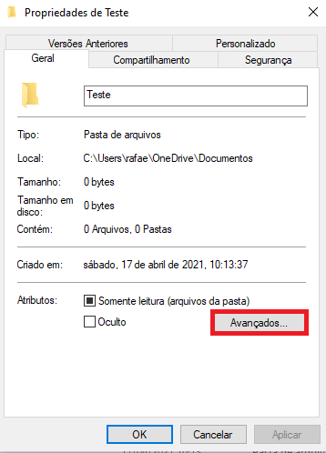
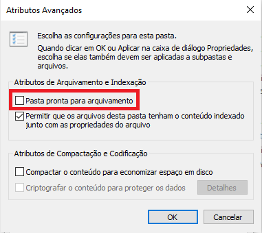
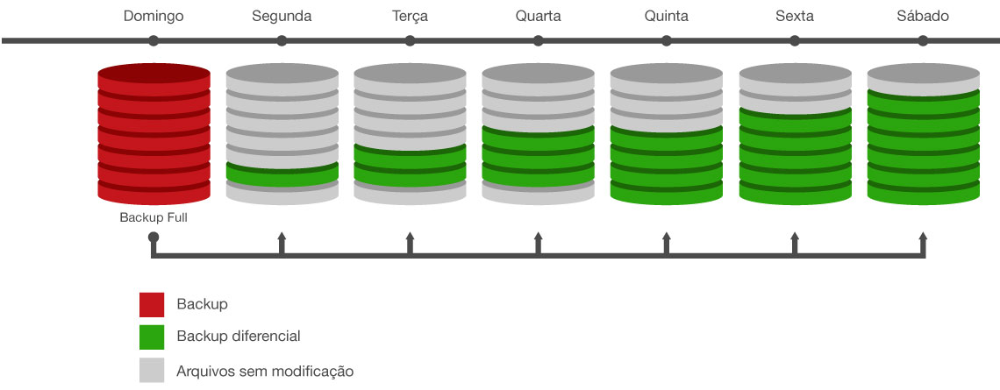
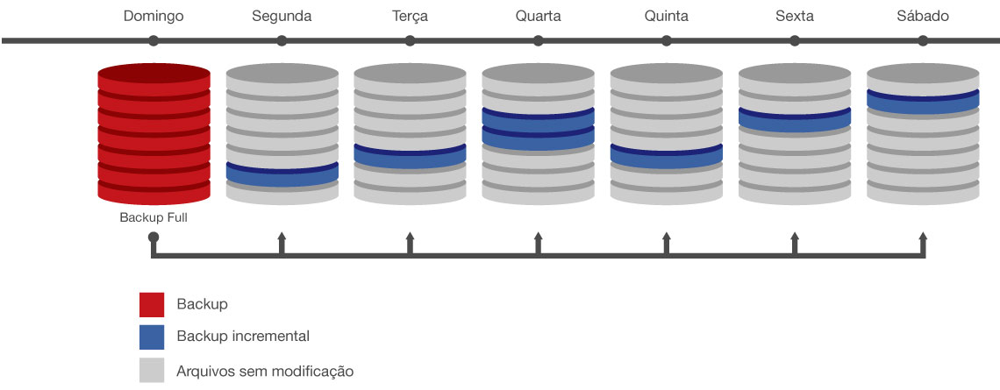

<!--Botão para voltar para a página anterior (posts do corrente alternativa)-->

  <a href="javascript:history.back()" style="color: white; text-decoration: none;">&lt;</a>

O _backup_ ou cópia de segurança é uma medida de segurança a qual consiste na ação de copiar arquivos, permitindo sua recuperação em caso de perda. Trata-se de um recurso de grande importância para a segurança da informação porque garante o princípio da disponibilidade. Apesar de ser mais associado ao acesso lógico dos arquivos e informações, sua implementação pode ocorrer de forma física, através da redundância de equipamentos, por exemplo.

Ressalta-se que essa medida deve ser feita fora do ambiente original com o uso de cds, pen-drives, hds externos, nuvem.

## **Formas de** **_backup_**

### **Quente (****_hot_****)**

Se o _backup_ for feito na forma quente, o sistema poderá permanecer _online_, sendo acessado normalmente, enquanto as cópias de segurança são feitas.

### **Fria (****_cold_****)**

Enquanto que, se a cópia de segurança for feita da forma fria, seu sistema deve ficar _off-line_ para a realização das suas cópias de segurança sem que haja a intervenção de algum usuário acessando o sistema.

## **Arquivamento**

Antes de abordar os tipos de _backup_, é importante explicar a respeito do arquivamento ou arquivo morto. Esse marcador consiste em um atributo dos arquivos o qual pode ser visualizado nas suas propriedades e tem a permite identificar se o arquivo ou a pasta sob análise deve ser arquivada.

A marcação do arquivamento pode ser feita por softwares de _backup_ ou programas capazes de modificar o conteúdo do arquivo. Ou seja, se essa opção estiver selecionada, há um indicativo de que a pasta ou arquivo esteve sujeito a modificações ou foi salvo, mas seu _backup_ não está atualizado e a cópia dessa informação deverá ser feita no próximo. Porém, como será visto em seguida, há tipos de cópias de segurança que não modificam esses atributos e, desse modo, essa opção não pode ser vista como garantia absoluta. Portanto, um arquivo com a marcação de que passou por _backup_ tem sua propriedade de arquivamento desmarcada.

Para acessar esse atributo, deve-se clicar com o botão direito sobre um arquivo ou pasta e selecionar a opção Propriedades.

Posteriormente, a configuração Avançados, presente na seção Atributos, deve ser escolhida conforme mostrado abaixo:

Por conseguinte, o marcador de arquivamento ou arquivo morto será exibido:

## **Tipos de** **_backup_**

### **Simples (cópia)**

No _backup_ simples, ocorre a gravação das pastas e dos arquivos selecionados, mas não há a marcação deles como arquivos que passaram pela cópia de segurança. Ou seja, seu atributo de arquivo morto não é desmarcado (não limpa os marcadores de arquivamento).

Esse tipo de _backup_ apresenta o aspecto positivo de não afetar as outras operações de cópia de segurança. Com isso, é possível executá-lo entre _backups_ normal e incremental, por exemplo.Todavia, ele não é capaz de fazer compactação nem controlar os erros. Além disso, a sua operação é muito demorada, ocupa muito espaço e não faz a alteração dos atributos dos arquivos.

### **Normal (completo, total, global ou _full_)**

O _backup_ normal copia todos os arquivos selecionados e faz a marcação deles como arquivos que passaram pela cópia de segurança. Assim, seu atributo de arquivo é desmarcado (limpa os marcadores de arquivamento).

Ele também pode ser chamado de _backup_ completo, pois permite que, somente com a cópia mais recente do arquivo, seja possível restaurar todos os arquivos. Por causa dessa característica, sua presença é exigida para a recuperação dos arquivos. Além do mais, ele deve ser o primeiro a ser feito e é executado quando ocorre a criação de um conjunto de _backups_, sendo complementado pelas outras cópias de segurança.

Diferentemente do simples, o completo limpa os marcadores, compacta dados e controla erros. Entretanto, costuma ser um processo demorado e requer muito espaço.

### **Diário**

Ao ser executado, o _backup_ diário copia todos os arquivos selecionados que sofreram modificações durante o dia. Após passarem por uma cópia de segurança desse tipo, os arquivos não são marcados como se tivessem passado por _backup_ (não limpa os marcadores de arquivamento).

Ele grava arquivos e pastas, criados ou alterados na pasta referente ao _backup_, compacta os dados, controla os erros, gasta menos tempo e espaço. Apesar disso, há o risco de que os dados gravados em um mesmo dia possam ser perdidos.

O diário gasta menos tempo e espaço, mas os dados, gravados no mesmo dia, podem ser perdidos dependendo do horário em que seja feita a cópia de segurança.

### **Diferencial**

O _backup_ diferencial copia arquivos criados ou alterados após o último normal ou incremental. Ele não faz a marcação dos arquivos como passados por _backup_ (não limpa os marcadores de arquivamento).

Se houver a combinação das cópias de segurança normal e diferencial, a restauração de arquivos e pastas exigirá somente os últimos normal e diferencial.

Ele compacta os dados e controla os erros. Porém, por ser acumulativo, a recuperação pode ser demorada se ocorrerem muitas modificações.

### **Incremental**

O _backup_ Incremental copia apenas os arquivos criados ou alterados desde o último normal ou incremental e os marca como arquivos que passaram pela cópia de segurança (limpa os marcadores de arquivamento).

Se houver a combinação entre o normal e o incremental, será necessário somente o último normal e todos os conjuntos de incrementais para a restauração dos dados.

Ele compacta os dados e controla os erros, é o mais rápido, demanda pouco espaço de mídia. Mas a sua restauração, a qual exige que o _backup_ esteja completo, pode ser demorada.

Uma das diferenças entre o incremental e o diferencial se encontra na marcação do atributo de arquivamento.

## Conclusão

Por fim, é perceptível como o backup é uma ferramenta de extrema importância para garantir a disponibilidade dos arquivos e pastas e à sua recuperação em caso de perdas.  Dessa maneira, é interessante ter conhecimentos a respeito do tipo e da forma como os backups podem ser feitos para se prevenir da exclusão de dados úteis seja no contexto pessoal ou institucional, a fim de uma melhor adaptação às Políticas de Segurança empresariais por exemplo.

## Referências

DICAS de Informática Básica. In: O que é Backup?. \[S. l.\], 2020. Disponível em: <https://www.cursosdeinformaticabasica.com.br/o-que-e-backup/#:~:text=Arquivos%20e%20pastas%20criados%20ou%20alterados%20ap%C3%B3s%20o%20%C3%BAltimo%20backup,N%C3%A3o%3B&text=Incremental%20%E2%80%93%20um%20backup%20Incremental%20copia,atributo%20de%20arquivo%20%C3%A9%20desmarcado>). Acesso em: 1 abr. 2021.

MICROSOFT. In: Suporte da Microsoft. \[S. l.\], 2020. Disponível em: <https://support.microsoft.com/pt-br>. Acesso em: 1 abr. 2021.

GRAN cursos Online. In: Gran cursos Online. \[S. l.\], 2018. Disponível em: <https://www.grancursosonline.com.br/>. Acesso em: 5 fev. 2021.
