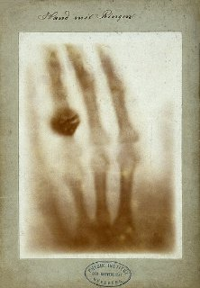
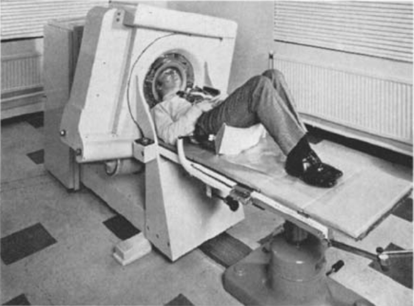
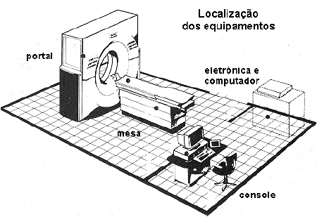
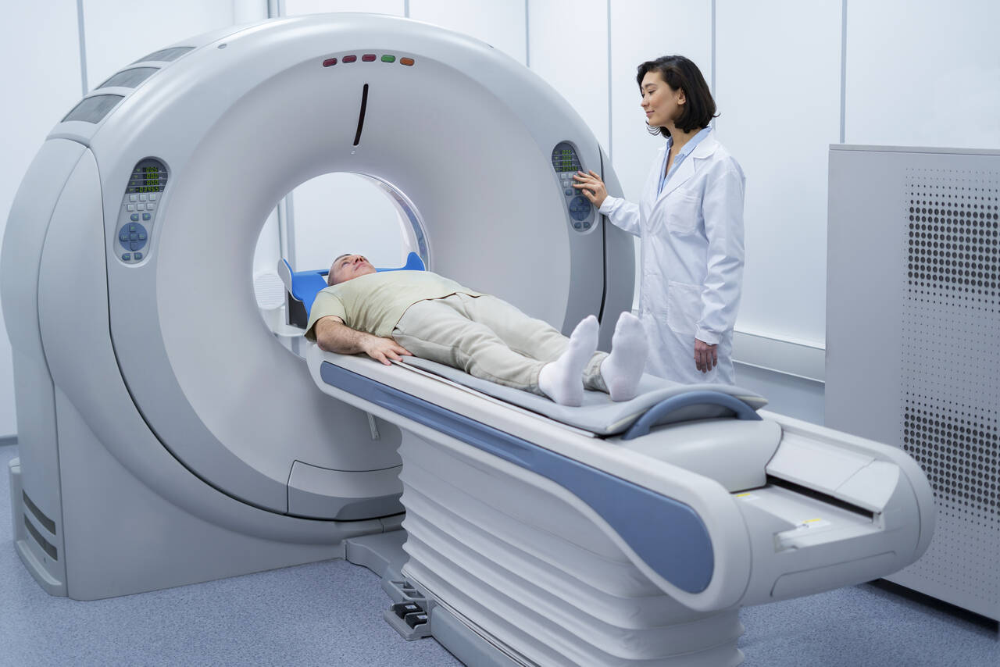
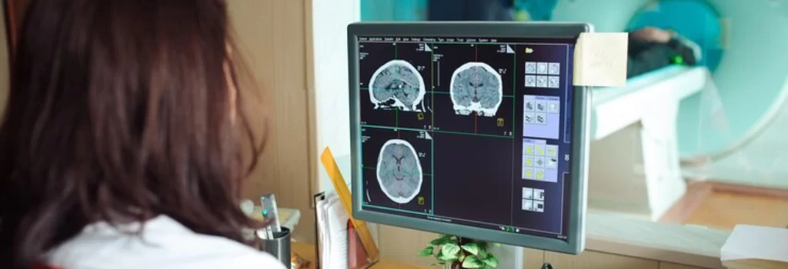
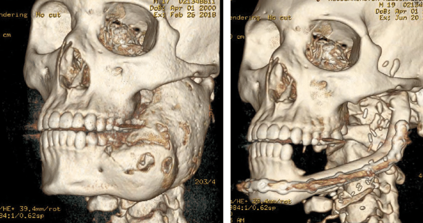
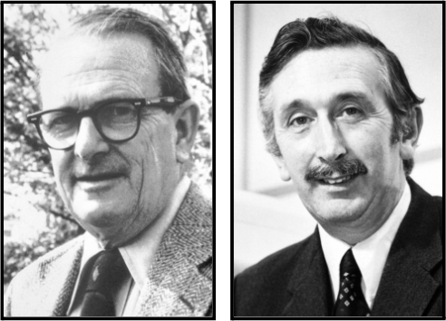

Sendo idealizada em 1967 pelo engenheiro eletricista Godfrey Hounsfield, com contribuições anteriores do físico sul-africano Allan Cormack e baseando-se nos estudos do matemático austríaco Johann Radon, a tomografia computadorizada (TC) trouxe diversos avanços para a área da saúde, uma vez que permite o diagnóstico de patologias onde anteriormente eram necessários procedimentos cirúrgicos invasivos.
A história do desenvolvimento da TC é tão fascinante quanto suas contribuições para todo o mundo.

## A TC no decorrer da história

Durante o final do século XIX, o físico alemão Wilhelm Conrad Röntgen, enquanto estudava o fenômeno da luminescência produzida por raios catódicos num tubo de Crookes, protagonizou a descoberta dos chamados raios X, nomeados por seu comportamento não ser conhecido na época. Para testar sua descoberta, ele utilizou a mão esquerda de Anna Bertha Ludwig, sua esposa, como alvo da primeira radiografia de uma parte do corpo humano. Tendo auxiliado a humanidade, evoluindo e assumindo atuações diversas na pesquisa de diagnósticos no corpo humano, os raios X têm variadas aplicações e usabilidades na medicina. Enxergar dentro do corpo sem abrir o paciente sempre foi um  dos objetivos na área médica e formas de melhorar a qualidade dessas imagens sempre foram buscadas pelos mais diversos pesquisadores. 

*Primeiro raio-x feito por Wilhelm Röntgen, 1895.*

Em 1917, os estudos do matemático austríaco Johann Radon e sua equação matemática chamada de “transformada de Radon” demonstravam que, a partir de um conjunto de projeções, era possível reproduzir objetos tridimensionais, uma vez que provou a possibilidade da reconstrução de uma função de duas variáveis através do conhecimento de suas integrais sobre retas, porém, só foi realmente utilizado de forma apropriada em 1963 com o trabalho de Allan Cormack. 

Físico e matemático, Cormack estudava a distribuição de coeficientes de atenuação do corpo para o tratamento de radioterapia, focando em direcioná-la melhor ao tumor alvo, mas levantou dentro de seus estudos uma questão: “Supondo que se conheça todas as  integrais de linha através de um corpo com densidade variada, podemos reconstruir esse mesmo corpo?”. Após encontrar resposta positiva e utilizando-se das informações que Radon havia fornecido, um teorema se transformou em uma ferramenta prática, uma vez que, através de informações exteriores ao corpo alvo, poder-se-ia obter informações do seu interior.

Paralelamente, o engenheiro, experiente em radares e criador do primeiro computador totalmente transistorizado inglês, Godfrey Hounsfield já possuía interesse no estudo de objetos tridimensionais através da reconstrução obtida pela absorção heterogênea de radiação. Seu primeiro protótipo possuía uma fonte baseada em amerício-241, emissora de raios gama, porém, a aquisição da imagem era de longos nove dias e o computador levava 150 minutos para processá-la. Um tempo depois, vendo a similaridade das propriedades dos raios X com os raios gama, optou por substituir a fonte anterior e, só com essa mudança, o tempo de aquisição de imagens foi reduzido para nove horas. 

Após se reunir com diversos radiologistas experientes do Hammersmith Hospital, em Londres, surgiu a ideia de se concentrar na criação de um aparelho voltado para o crânio. Depois de obter diversas imagens experimentais a partir de peças, animais e cérebros fixados em formol (que demonstraram algumas alterações), foi realizado o primeiro procedimento em um ser humano vivo, a fim de diagnosticar um tumor no lobo frontal esquerdo, com suspeita ainda não confirmada. Quando a imagem foi obtida, comprovando sua existência, gerou uma animação não só no engenheiro, mas também naqueles que tiveram a oportunidade de ver o equipamento em funcionamento.

*Exame sendo realizado nos primeiros tomógrafos, no Hammersmith Hospital.*

O trabalho escrito de Hounsfield não foi publicado em 1971 por conta da greve dos correios, além do congresso anual do British Institute of Radiology, em Amsterdã, ter demonstrado pouco interesse nas imagens seccionais de peças de cadáveres e de animais que foram apresentadas. No entanto, em 1972, a revista Times publicou uma imagem do primeiro aparelho funcional, o que gerou interesse da comunidade médica em seu trabalho. Ao ser comercializado, o tempo de aquisição de cada corte do equipamento já era de dois minutos, uma vez que um minicomputador mais eficiente foi adicionado ao sistema. A tecnologia continuou evoluindo, dando origem a gerações seguintes do maquinário, cada vez mais rápidas e com uma gritante redução dos preços dos aparelhos e dos exames, que continua se desenvolvendo até os dias de hoje.

## Os principais componentes do tomógrafo

- Gantry (Portal): O gantry é o equipamento que possui uma abertura central, na qual o paciente fica posicionado durante o procedimento. Em seu interior, localizam-se a maior parte dos dispositivos eletrônicos e eletromecânicos, incluindo sensores e a ampola de feixes, que rotacionam durante a realização do escaneamento.

- Ampola de raio X: A emissão de raios X se baseia  na interação de dois elementos: o catódio e o anódio rotatório. Nesse sentido, o catódio libera uma carga de elétrons, que após acertarem o anódio, ocorre a geração dos raios X.

- Sensores: Os sensores (ou detectores) constituem-se por serem os responsáveis pela captação da radiação emitida pela ampola. Essa obtenção é fundamental, pois em razão dela, ocorre a transformação dos dados adquiridos em sinais elétricos para a formação da imagem.

- Mesa de exames: Local onde o paciente se posiciona para o início do exame.

*Componentes do tomógrafo.*

## O funcionamento por trás das cortinas do exame da TC

*Paciente deitado sobre a mesa de exames adentrando o gantry.*

Inicialmente, o paciente deita-se sob a mesa de exame e adentra o gantry que, depois do início do procedimento, rotaciona em torno da área desejada. Após a geração dos raios x no interior da ampola, essa dispara uma sequência dessa radiação no examinado.

Após a liberação da energia, os raios penetram a pele do paciente e percorrem sucessivamente a área corporal escolhida até o encontro com um filme localizado no eixo oposto do feixe. Todavia, a essência da TC encontra-se exatamente durante esse breve intervalo, tendo em vista que, em virtude da tênue diferença de densidade das estruturas examinadas - como ossos ou tecidos macios - e do espaço restante, obtêm-se dados suficientes para a formação da imagem interna do corpo.
 
Conforme a chegada dos raios x no filme, os sensores transformam os dados obtidos em sinais elétricos que serão encaminhados para o computador. E assim, os sinais adquiridos são digitalizados rapidamente pelo sistema computacional e, por meio de um software sofisticado, produz a imagem preta e branca da região corpórea.

## A magia da tomografia computorizada

Apesar da indiscutível importância do tomógrafo para o exame da tomografia computorizada, a verdadeira mágica do procedimento acontece quando os dados adquiridos pelos sensores chegam ao software no computador para a formação da imagem.

Antes de explicar como o programa funciona, é importante ressaltar que não existe um único sistema universal, mas sim uma variedade de programas desenvolvidos com diferentes capacidades para cobrir a vasta complexidade de exames hospitalares. Com isso, dentre as inúmeras empresas responsáveis pela criação e venda desses softwares, temos como exemplo a “Philips Healthcare” e a “GE Healthcare”.

*Imagem do cérebro criada pelo software da tomografia computadorizada.*

Diante disso, a formação da imagem começa pela chegada dos dados no computador, e inicia-se um processo chamado de “Reconstrução Tomográfica”, sendo esse procedimento o responsável pela origem da representação tridimensional (3D) do volume interno do corpo. Esse processo tem duas etapas, respectivamente: A Retroprojeção e a Filtragem. 

De modo geral, a retroprojeção se baseia na exibição de uma imagem 3D por meio da junção das obtidas pelos sensores no formato 2D. Simultaneamente à retroprojeção, a filtragem é responsável pela retirada de informações indesejadas (como movimentação do paciente, ou imperfeições no equipamento). E assim, depois da primeira reconstrução, o software também permite ajustar várias configurações, como contraste, brilho e espessura das fatias. Finalmente, as imagens são reconstruídas e disponibilizadas para o profissional para a análise da condição do paciente. 

*Reconstrução 3D do maxilar de um paciente.*

## O Nobel

O advento do primeiro tomógrafo computadorizado foi tão revolucionário que, em 1979, a Academia Nobel do Instituto Karolinska, na Suécia, atribuiu o Prêmio Nobel de Fisiologia ou Medicina daquele ano a Allan M. Cormack e Godfrey N. Hounsfield, desenvolvedores da tomografia assistida por computador. Não se pode deixar de destacar o discurso inspirador que Cormack, representando ambos, proferiu durante a cerimônia de premiação:

‘’Enquanto há ironia na premiação, há também esperança de que, agora nestes dias de especialização aumentando, há uma unidade na experiência humana, uma unidade claramente conhecida por Alfred Nobel, que um engenheiro e um físico, cada um de seu próprio modo, contribuíram um pouco para o avanço da Medicina.’’

 
*Allan Cormack e Godfrey Hounsfield.*

Desde então, a tomografia computadorizada continua sendo alvo de intensas pesquisas que contribuem para diversos aprimoramentos, tanto do ponto de vista de hardware quanto de software. Permitindo, assim, resoluções cada vez melhores, obtenção de imagens tomográficas dinâmicas, como por exemplo, sincronizando as fases do funcionamento do coração com a aquisição das projeções. Ademais, as pesquisas nesse campo vão muito além do uso na medicina, áreas como geologia, indústria do petróleo, tomografia industrial, que é aplicada em ensaios não destrutivos, entre outros, utilizam dessa tecnologia para muito dos avanços. Isso mostra, na prática, que mesmo áreas distintas podem e devem se relacionar para o desenvolvimento de um melhor futuro para a humanidade.

## Referências

[https://www.nobelprize.org/prizes/medicine/1979/summary/](https://www.nobelprize.org/prizes/medicine/1979/summary/)  

[https://certi.org.br/blog/tomografia-industrial/](https://certi.org.br/blog/tomografia-industrial/)

