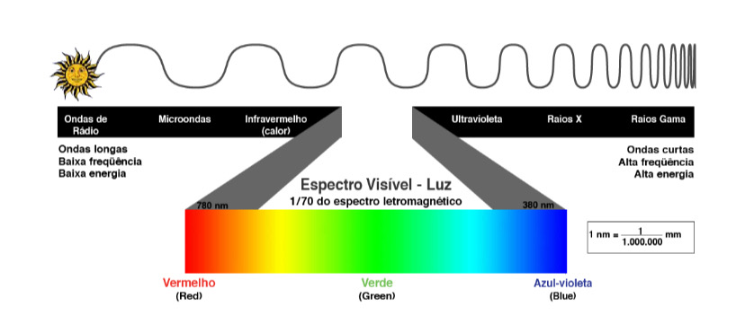
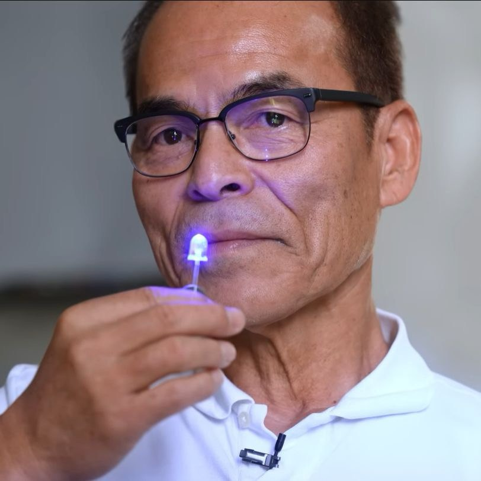
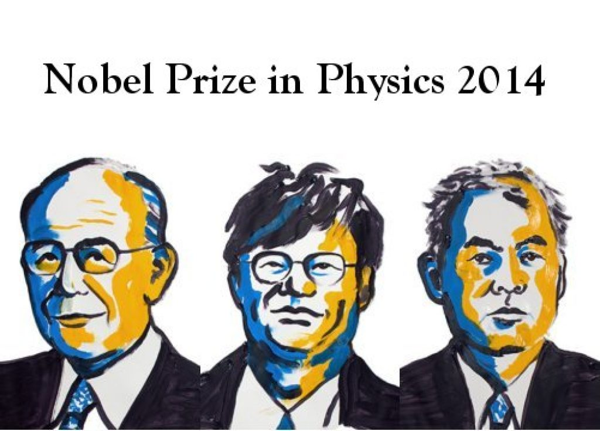

---
title: "O LED Azul: Como uma pequena invenção revolucionou o mundo e abriu portas para a tecnologia moderna."
date: "2024-06-28"
categories: 
  - "led"
  - "corrente-alternativa"
cover: "images/led_azul.jpg"
type: "featured"
authors:
  - leonardoPedreira
---

Na atualidade, é indiscutível como a presença do LED azul e suas outras cores estão em todo lugar: seja nas telas dos celulares, nas televisões ou nas lâmpadas das residências. Porém, engana-se quem pensa que sua criação foi um processo simples e rápido, pois a existência do LED azul já foi considerada uma vez impossível pelos pesquisadores. Apesar de pouco conhecida, a história por trás do primeiro LED azul constrói-se pela mistura de resistência, sofrimento e, sobretudo, coragem de um engenheiro eletricista que batalhou contra todos aqueles que o humilharam e desacreditaram de sua capacidade. Ficou curioso? Continue lendo!

## A disputada corrida para a sua criação

Em primeira instância, é normal de se perguntar como uma coisa aparentemente simples como um LED azul poderia ser considerada quase impossível pela comunidade científica, afinal, o LED vermelho e verde já tinham sido criados. Para entender essa dificuldade, é preciso entender primeiramente como um LED transmite energia: A luz emitida pelo aparelho decorre da passagem de uma corrente elétrica pelos terminais, causando uma interação entre elétrons e, assim, emitindo fótons. Porém,dentro do espectro energético da luz, a cor azul necessita de uma maior quantidade de energia para ser formada se comparada com o vermelho e o verde, e encontrar um meio capaz de emitir essa energia era o maior obstáculo para os cientistas.

_Espectro eletromagnético da luz_

Apesar de toda essa dificuldade, por que grandes companhias internacionais como a Sony e a Toshiba investiram dezenas de milhões de dólares em pesquisas para patentearem o primeiro LED azul? Essa disputa ocorreu em razão da possibilidade de formar o branco com a combinação das três cores primárias (azul, verde e vermelho). Ou seja, com o azul em mãos, isso permitiria às empresas o acesso a todas outras cores, e, assim, abrindo portas para uma nova geração da tecnologia. Entretanto, foi durante esse período que um desconhecido engenheiro eletricista japonês, em seu pequeno laboratório, também começou as suas pesquisas para a criação do LED azul, e contra todas as expectativas da comunidade científica, esse homem futuramente revolucionaria o mundo.

## Shuji Nakamura: Uma história de superação e audácia

_Foto de Shuji Nakamura_

Nascido em uma pequena ilha pesqueira no dia 22 de maio de 1954, Shuji Nakamura desde criança sempre se interessou pela área da física e da matemática, e optou pelo curso de engenharia elétrica para sua graduação. Após concluí-la, escolheu a área de semicondutores como foco para seu mestrado, e depois de inúmeras falhas ao tentar encontrar um emprego, ele finalmente foi contratado pela então pequena empresa chamada Nichia. Vendo o avanço das pesquisas globais sobre o LED azul, Nakamura propôs uma aposta arriscada ao seu chefe, Nobuo Ogawa: que ele seria o primeiro cientista do mundo a desenvolver tal tecnologia. Embora nem mesmo ele acreditasse que seu chefe o aprovaria, surpreendentemente, Nobuo aceitou a proposta e a empresa investiu aproximadamente 3 milhões de dólares em sua pesquisa, sendo esse o primeiro grande passo de Nakamura.

Mesmo com a aprovação da verba, isso não significaria que a jornada seria fácil, afinal, o engenheiro eletricista agora estava em uma corrida contra o mundo. Para alcançar seu objetivo, era preciso primeiro um requisito crítico: um cristal de alta qualidade dentro do LED. Uma estrutura cristalina quase perfeita era imprescindível para seu desenvolvimento, pois quaisquer defeitos na rede interrompiam o fluxo de elétrons, transformando a energia em calor ao invés de luz visível.Como material para a formação do cristal, existiam dois candidatos escolhidos pelos pesquisadores: selenato de zinco e o nitreto de gálio. Entretanto, o nitreto de gálio foi desconsiderado pela grande maioria dos cientistas por seu maior grau de imperfeição cristalina se comparado ao cristal criado pelo selenato de zinco. Apesar disso, Nakamura decidiu realizar sua pesquisa no nitreto de gálio, pois existia uma menor competição na área.

Para realizar sua investigação, Nakamura se baseou nas pesquisas feitas pelos estudiosos da Universidade de Nagoya, Dr. Isamu Akasaki e o Dr. Hiroshi Amano, tendo em vista que eles foram os primeiros a conseguirem desenvolver um cristal de nitreto de gálio, apesar de ainda ser considerado imperfeito. Após um ano e meio de pesquisa, Nakamura finalmente conseguiu desenvolver o primeiro cristal de nitreto de gálio classificado como perfeito. A sacada de Nakamura foi a introdução de um segundo tubo de fluxo no MOCVD, aparelho designado para a geração de cristais, que liberava nitrogênio e hidrogênio sobre o metal, formando um cristal uniforme.

_Representação de um MOCVD_

Porém, mesmo com a tentativa bem sucedida de Nakamura, sua situação não melhorou, pois a comunidade científica não acreditava no futuro do nitreto de gálio como sendo o material correto. Com a chegada do novo CEO da Nichia, Eiji Ogawa, que pensava que as pesquisas de Shuji não somente eram inúteis, mas também um desperdício colossal de dinheiro, foi dada a ordem de parada da pesquisa imediatamente. Mesmo depois da determinação de Eiji, Nakamura, em um ato de resistência, contrariou-o e continuou a realizar sua investigação.

Como próximo desafio de Nakamura, era preciso desenvolver um nitreto de gálio carregado positivamente para interagir com o tipo negativo no interior do LED e conduzir a corrente. No entanto, Dr. Isamu Akasaki e o Dr. Hiroshi Amano estavam à sua frente, pois já tinham gerado um tipo positivo anterior, ao enriquecer seu cristal de nitreto de gálio com um feixe de elétrons. Esse método foi descartado posteriormente, haja vista que era lento demais para fins comerciais e também não se tinha uma razão clara do porquê o feixe de elétrons causava o enriquecimento do cristal. Porém, Nakamura pensou algo brilhante: e se, na verdade, o cristal só precisasse de energia? Para testar sua hipótese, ele o aqueceu a uma temperatura de 400 °C  e, ao retirá-lo, percebeu que não só tinha criado um tipo positivo mais eficiente do que os já formados, como também desenvolveu um procedimento mais eficiente para o comércio.

E assim, combinando todas as suas descobertas, Nakamura apresentou ao mundo o primeiro protótipo do LED azul, apesar de emitir, na verdade, uma cor azul violeta e com uma potência de saída de luz de apenas 42 microwatts, enquanto o requisito mínimo era 1000 microwatts. Por não ter sido capaz de criar um produto definitivo, Eiji Ogawa ordenou mais uma vez que Nakamura parasse suas pesquisas. Mesmo com sua reputação em jogo, ele ignorou as ordens de Eiji e disse que estava decidido em gerar o LED azul perfeito.

A solução final para o problema do engenheiro foi uma combinação simples: a mistura de alumínio com nitreto de gálio, o que impediu o escapamento dos elétrons no composto. Desse modo, após 30 anos de pesquisa e dedicação, Shuji Nakamura apresentou ao mundo o primeiro LED azul em 1992 com uma potência de 1500 microwatts.

_Shuji Nakamura com o primeiro LED azul_

## O Nobel

Mesmo após 32 anos desde sua formação, o LED azul ainda se constitui como uma das revoluções mais importantes para a tecnologia moderna. Ele se tornou uma peça indispensável no dia a dia, permeando desde a iluminação residencial e telas de smartphones até em procedimentos fototerápicos para o tratamento de distúrbios do sono e doenças da pele. Por conta dessa importância e da vasta aplicação, em 2014 a Academia Nobel do Instituto Karolinska, na Suécia, concedeu o Prêmio Nobel da física para Shuji Nakamura, Hiroshi Amano e Isamu Akasaki pela ‘’invenção de díodos emissores de luz azul eficientes que permitiram fontes de luz branca brilhantes e economizadoras de energia’’. Dessa forma, é perceptível que o LED azul transcende a mera iluminação, tornando-se um símbolo de inovação e um marco histórico para a tecnologia.

_Representação de Isamu Akasaki, Hiroshi Amano e Shuji Nakamura, ganhadores do Nobel de 2014_

## Referências
<https://www.nobelprize.org/prizes/physics/2014/nakamura/biographical/>  
<https://pt.m.wikipedia.org/wiki/Shuji_Nakamura>  
<https://www.youtube.com/watch?v=AF8d72mA41M&t=242s>  
<https://www.nobelprize.org/prizes/physics/2014/press-release/>  
