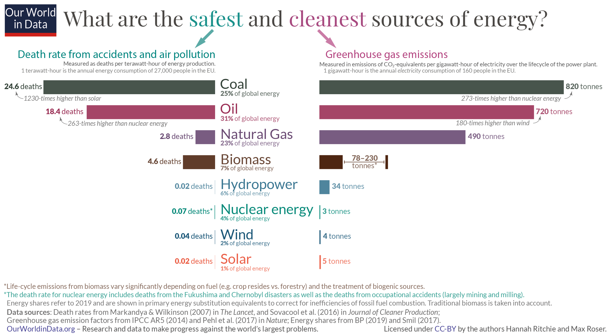

A geração de energia a partir de reações nucleares é um dos maiores marcos tecnológicos realizado por humanos e já representa cerca de 5% da energia consumida pelo mundo, com isso é interessante entender algumas de suas vantagens.

## Segurança

Dentre as vantagens da energia nuclear está sua segurança, sendo considerada uma das fontes de energia mais seguras, com uma taxa de mortalidade extremamente inferior as outras principais fontes de energia, como por exemplo resultando em 99.8% menos mortes do que lignito, e 99.7% menos do que carvão mineral. Botando em perspectiva, morrem em média 25 pessoas por ano prematuramente por conta do carvão mineral enquanto leva em média 14 anos para uma pessoa morrer por consequencias do uso de energia Nuclear.

Essa comparação toma como base a proporção de mortes por energia produzida em twh, como podemos ver pelo gráfico abaixo:

<iframe style="width: 100%; height: 600px; border: 0px none;" src="https://ourworldindata.org/grapher/death-rates-from-energy-production-per-twh" width="300" height="150"></iframe>

_Source: [OurWorldInData.org](http://OurWorldInData.org)_

As mortes foram contabilizadas e estimadas levando em conta principalmente as causadas por acidentes, como Chernobyl ou acidentes ocasionais em minas, e também as mortes prematuras causadas por conta da poluição do ar gerada pelas fontes não limpas.

A consequência diretas dessa discrepância em termos de segurança é que o uso de Energia Nuclear, e outras fontes seguras, estão salvando vidas que estariam sendo perdidas levando em conta que o consumo energetico tem aumentado ao longo dos anos, e com isso a demanda cresce em conjunto, oque implica que para diminuirmos o uso de fontes não seguras precisaremos de alternativas seguras.

### Chernobyl e demais desastres nucleares

É importante ressaltar aqui que uma parcela considerável das mortes ocasionadas pela energia Nuclear foi devido as negligências e descuidos que acarretaram em acidentes graves, o maior deles o do Reator da Planta Nuclear de Chernobyl, sendo estimado cerca de 60 mil mortes causadas pelo incidente.

Os impactos na aceitação da energia nuclear foram muito comprometidos devido ao incidente. Felizmente devido aos avanços da ciência e a seriedade em relação ao tema, as chances de um incidente em mesma escala se repetir são baixos.

## Livre de Carbono

Sendo considerada uma fonte limpa não renovável a energia nuclear é uma das melhores, senão a melhor, alternativa energética a ser utilizada como uma solução no combate a crise climática, devido a sua taxa de emissão de carbono trivial quando comparada com a quantidade de energia gerada em watt-hora.

A energia Nuclear não é considerada como energia renovável pois apesar de ser limpa e ter baixa taxa de emissão de carbono, o material usado para gerar energia é o urânio enriquecido, que é consumido no processo de geração de energia. Isso então torna as principais formas de geração de energia nuclear atuais não renováveis, visto que a quantidade de Urânio enriquecido demora muito tempo para ser reposta.

Outra consequência imediata é a produção de resíduos que precisam ser descartados adequadamente, que em conjunto com o fato do Urânio Enriquecido ser esgotável, demandam do processo de geração alternativas tecnológicas que permitam reutilização dos subprodutos do processo de geração.

Com isso, quando comparada com as demais fontes de energia, a nuclear é uma das principais alternativas levando em conta tanto o curto prazo quanto o médio-longo prazo, pois mesmo que não seja renovável, sua baixa emissão de CO2 torna a alternativa segura a curto prazo com baixo índice de mortes e segura a longo prazo com baixo impacto no meio ambiente.

## Densidade Energética

 _Source: [XKCD Comics](https://xkcd.com/1162/)_

Outra das principais vantagens das energias nucleares é sua densidade energética, ou seja, o quanto de energia pode ser gerado a partir do material usado como base. Para se ter uma noção melhor, um quilograma de Urânio é capaz produzir milhões de vezes mais energia do que o carvão mineral(83,140,000 MJ/Kg para o Uranium 235 comparado com 24 MJ/Kg para o carvão mineral).\[1\]

Essa diferença absurda se dá aos princípios físicos por trás da forma que a energia é gerada. Mesmo que não seja possível converter toda a energia gerada em energia elétrica para consumo final, a diferença absurda torna a alternativa viável tanto na geração de energia como transporte de material, que é um dos maiores problemas logísticos em termos de energia.

## Conclusão

A partir das vantagens abordadas podemos perceber os impactos e importâncias do uso da energia nuclear como alternativa viável para as demais fontes, e também seu potencial como forma sustentável de gerar energia. Sua alta densidade energética também oferece potenciais desenvolvimentos tecnológicos em áreas mais específicas como transporte interplanetário e armazenamento de energia.

## Referências

- [\[1\] http://www.plux.co.uk/energy-density-of-uranium/](http://www.plux.co.uk/energy-density-of-uranium/)
- [https://ourworldindata.org/nuclear-energy](https://ourworldindata.org/nuclear-energy)
